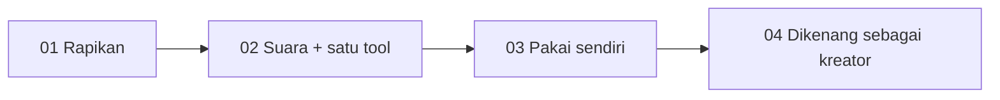
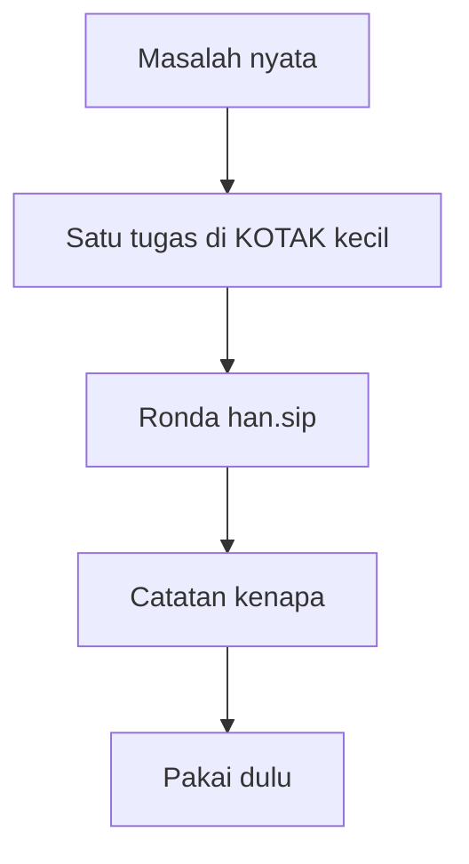
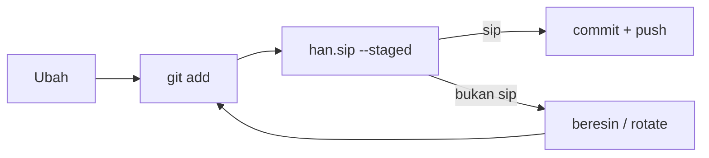

# Alur — Ganezha / KOTAK kecil

Tiga loop. Kalau bingung, lihat yang bertanda **sekarang**.

## Loop 01 · Jadi kreator

| # | Tahap | Status |
|---|---|---|
| 01 | Rapikan bengkel | selesai |
| 02 | Suara, lalu satu tool (`han.sip`) | selesai |
| 03 | **Pakai sendiri** — pre-commit `--staged` di repo kerja | **sekarang** |
| 04 | Dikenang sebagai kreator | berikutnya |

## Loop 02 · Satu karya

1. **Masalah nyata** — bukan ide biar keren.
2. **Satu tugas** — MIT, cukup dibaca sekali duduk, tanpa `.env` asli.
3. **Ronda** — `--staged` sebelum commit; CI meronda folder utuh.
4. **Catatan kenapa** — 20 baris alasan, bukan cuma file.
5. **Pakai dulu** — hook di repo sendiri, baru tawarkan ke orang.

## Loop 03 · Setiap commit

`--staged` membaca **git index**, bukan seluruh laptop. File yang belum `git add` tidak dihitung.

Kalau error: ketawa dulu, baru beresin. Kalau secret pernah masuk git: **rotate**. Hapus file tidak cukup.

## Bukan ini

- Badge, snake, visitor counter
- Tool kedua sebelum tool pertama dipakai
- npm publish karena semangat
- Web3 sebelum kebiasaan git aman
