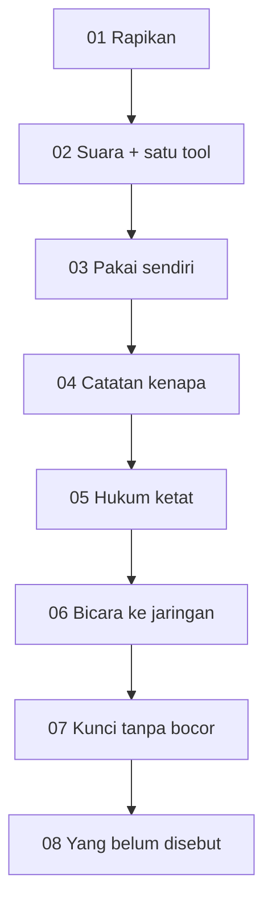
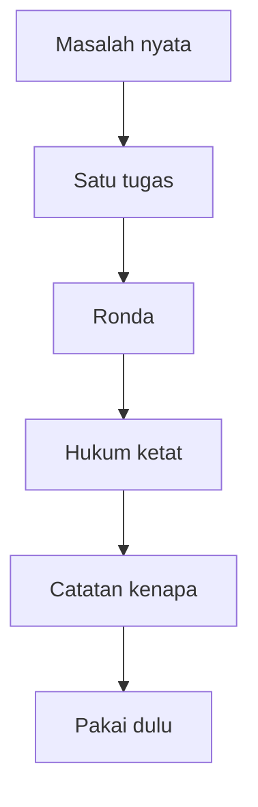
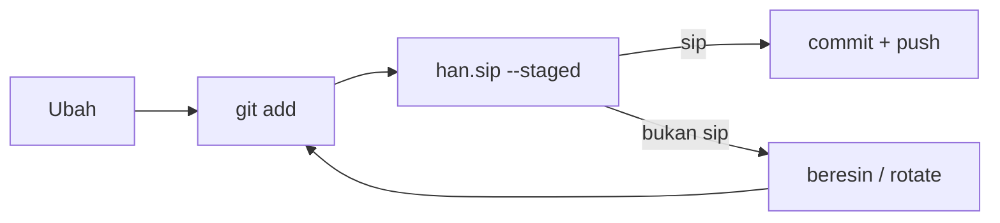

# Alur — Ganezha / KOTAK kecil

Tangga kualitas, bukan spanduk tujuan.  
Ilmu yang menilai ilmu. Tidak perlu diucapkan.

Kalau bingung, lihat yang bertanda **sekarang**. Tahap terakhir **tidak disebut**.

## Loop 01 · Tangga

| # | Tahap | Status |
|---|---|---|
| 01 | Rapikan bengkel | selesai |
| 02 | Suara, lalu satu tool (`han.sip`) | selesai |
| 03 | **Pakai sendiri** — pre-commit `--staged` | **sekarang** |
| 04 | Catatan kenapa | rakit |
| 05 | Hukum ketat — `tsc --strict`, tes yang boleh merah, ronda CI | rakit |
| 06 | Bicara ke jaringan — satu endpoint, satu tugas, tanpa kunci di git | rakit |
| 07 | Kunci tanpa bocor — syarat, bukan pengumuman | rakit |
| 08 | Yang belum disebut — karyanya nanti yang menamai diri | rakit |

08 tidak diisi judul produk. Disebut sekarang = pamer.

## Yang ditunjukkan, bukan yang diumumkan

- `satisfies` + `tsc --strict` — tipe yang mengawasi manusia
- `--staged` membaca git index (`git show :path`), bukan seluruh laptop
- Temuan: jenis, path, baris. **Nilainya diam**
- CI sebagai ronda: merah = sedang jujur

Lugu di suara. Ketat di mesin.

## Loop 02 · Satu karya

1. **Masalah nyata** — bukan ide biar keren.
2. **Satu tugas** — MIT, sekali duduk, tanpa `.env` asli.
3. **Ronda** — `--staged` lalu CI folder.
4. **Hukum ketat** — tipe dan tes. Longgar bukan lugu; itu ceroboh.
5. **Catatan kenapa** — 20 baris alasan.
6. **Pakai dulu** — hook di repo sendiri.

## Loop 03 · Setiap commit

`--staged` membaca **git index**. File yang belum `git add` tidak dihitung.

Kalau error: ketawa dulu, baru beresin. Kalau secret pernah masuk git: **rotate**. Hapus file tidak cukup.

## Bukan ini

- Badge, snake, visitor counter
- Tool kedua sebelum tool pertama dipakai
- Mengumumkan tujuan yang belum siap
- npm publish karena semangat
